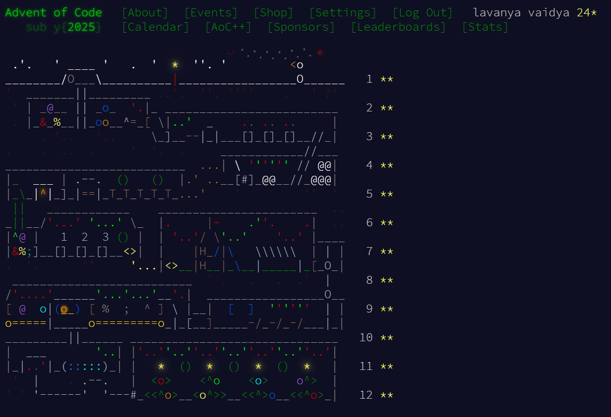

# 🎄 Advent of Code 2025

This repository contains my solutions for **Advent of Code 2025**.

Advent of Code 2025 was a lot of fun, even though the last few days were *crazy hard* for me. Pushed me hard enough that I ended up scrolling through the internet, reading other people’s solutions, and revisiting concepts multiple times. 😅

---

## 🧩 Repository Structure

```
.
├── README.md
├── images/
│   └── aoc-2025.png
├── DAY1/
├── DAY2/
├── ...
```

* Each day has its own folder
* Most of the solutions have no comments and explanation as I was quickly writing them, trying to beat the timer 😅. I will slowly polish my codes.

---

## 📸 But I finally did it



